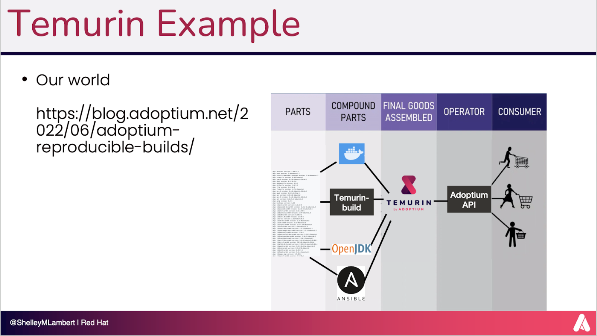

# Software Supply Chain Security

## What, Why and how

Bruno Georges


---

## Agenda

- What is Software Supply Chain Security
  - Let’s review together what it means and why does it matter
  - History and Facts.
  - Vulnerability exploit examples
- Going Deeper
  - Identify Supply Chain Attack Vectors
  - How can we secure this end to end
  - Standards, Frameworks, Tools: SSDF, SLSA, SBOM, Sigstore
- Putting this together
- Takeaways and recommendations
- Q&A

---

## Back in the Web 1.0 days

### Perl CGI Example


```perl
#!/usr/bin/perl
print "Content-type: text/html\n\n";
print "<html><body>Hello, World!</body></html>";
```

### C CGI Example

```c
#include <stdio.h>

int main() {
    printf("Content-Type: text/html\n\n");
    printf("<html><body>Hello, World!</body></html>");
    return 0;
}
```
---

## Supply Chain 1.0


---

## Introduction of Dependencies

### Late 1990s - Early 2000s

- Use of libraries like `cgi-bin`, `Mail::Form` in Perl
- Increased functionality, but also new vulnerabilities

### Perl with Dependencies

```perl
use CGI;
my $q = CGI->new;
print $q->header, $q->start_html('Hello World');
print $q->h1('Hello, World!');
print $q->end_html;
```

---

## What could go wrong?

- Introduction of CVEs (Common Vulnerabilities and Exposures) and exploits

### Examples
``` 
http://{url}/cgi-bin/FormMail.pl?recipient=spam@malicious.com&subject=Urgent=GotYou!
```

```bash
perl script.pl 'http://www.yourcompany.com; rm -rf /'
```

### Mitigation

- For FormMail: Validate and sanitize all inputs, particularly email addresses.
- For cgic: Use functions with bounds checking, such as ```strncpy```, and perform proper input validation


---
 ## Things needed to change

- Security Awareness and Education
- Code Reviews and Audits ( starting with peer programming / reviews) 
- Static Analysis Tools ( tools like ```lint``` ) 
- Following mailing lists & advisories such as CERT 
- Environment Hardening & Patch Management
- Security Testing and Penetration Testing (tools like ```satan``` ) 
- Secure Development Lifecycle (SDL)
- Process Integration: Incorporating security into every phase of the software development lifecycle, from design to deployment.
- Defining security requirements alongside functional requirements.

---

## The Birth of Secure Software Development Lifecycle (SDLC)

- Early 2000s: Organizations start adopting SDLC best practices
- Focus on identifying and mitigating vulnerabilities early in the development process

---

## Modern Frameworks: SSDF and SLSA

### SSDF (Secure Software Development Framework)

- Framework for integrating security practices into software development

### SLSA (Supply Chain Levels for Software Artifacts)

- Framework for ensuring the integrity of software artifacts

### Components

- **SBOM** (Software Bill of Materials)
- **Sigstore** for signing and verifying software

---


## Why do we care?

[NASA’s Boeing Starliner Crew Flight Test Launch – June 5, 2024 (Official NASA Broadcast)](https://www.youtube.com/watch?v=HneVxAmYcaA) 


---

## Eclipse Adoptium Download Trends

(https://dash.adoptium.net/trends)


---


---
## Shifting Left
### Red Hat play a leadship and key role upstream

- Red Hat [joined](https://www.redhat.com/en/blog/red-hat-joins-eclipse-adoptium-working-group) Eclipse Adptium WG in 2021. The OpenJDK code, build, tests and binaires have now a new home upstream.
- The Adoptium [security audit report](https://ostif.org/wp-content/uploads/2024/06/Temurin-Final-Report.pdf) and [response document](https://adoptium.net/pdf/temurin-audit-response.pdf) were published last month. :rocket:
- With the European Union’s Cyber Resilience Act (CRA) and for all this to work, we need to establish a common specifications for secure software development based on open source best practices. [Bring OSS foundation together and have a single voice](https://blogs.eclipse.org/post/mike-milinkovich/open-source-community-building-cybersecurity-processes-cra-compliance)
- Collaboration on the [Adoptium Temurin build's Supply Chain Security](https://outreach.eclipse.foundation/adoptium-temurin-supply-chain-security)

---




---

## Quarkus - Example

- Supersonic Subatomic Java  :rocket:
- Designed for Kubernetes and optimized for GraalVM and OpenJDK HotSpot
- A consumer :fork_and_knife: of OpenJDK and its dependencies.

---

## Building with External Dependencies

1. Managing dependencies
2. Ensuring the integrity of dependencies
3. Using trusted sources and repositories

---

## Generating SBOM Artifact

- Tools and practices for generating SBOMs
- Example: Using [CycloneDX](https://cyclonedx.org/) to generate an SBOM :cyclone:

---

## Signing with Sigstore :closed_lock_with_key:

- Benefits of signing artifacts 
- Example: Signing Quarkus artifacts with Sigstore 

---

## Examples: Identifying and Remediating Vulnerabilities

### Java Example: Log4j CVE

#### Identifying CVE in Log4j

1. **Create a Sample Java Project with a Vulnerable Log4j Dependency**

```bash
mkdir log4j-example
cd log4j-example
mvn archetype:generate -DgroupId=com.example -DartifactId=log4j-example -DarchetypeArtifactId=maven-archetype-quickstart -DinteractiveMode=false
cd log4j-example
```
---

2. **Add the Vulnerable Log4j Dependency to `pom.xml`:**

```xml
<dependencies>
    <dependency>
        <groupId>org.apache.logging.log4j</groupId>
        <artifactId>log4j-core</artifactId>
        <version>2.14.1</version> <!-- Vulnerable version -->
    </dependency>
</dependencies>
```
---

3. **Create a Sample Java File:**

```java
package com.example;

import org.apache.logging.log4j.LogManager;
import org.apache.logging.log4j.Logger;

public class App {
    private static final Logger logger = LogManager.getLogger(App.class);

    public static void main(String[] args) {
        logger.info("Hello, World!");
    }
}
```
---

4. **Compile and Run the Project:**

```bash
mvn package
java -cp target/log4j-example-1.0-SNAPSHOT.jar com.example.App
```

---

## Using SBOM to Identify the CVE

1. **Generate SBOM** Add the CycloneDX Maven plugin to your `pom.xml`:

```xml
<build>
    <plugins>
        <plugin>
            <groupId>org.cyclonedx</groupId>
            <artifactId>cyclonedx-maven-plugin</artifactId>
            <version>2.7.4</version>
            <executions>
                <execution>
                    <goals>
                        <goal>makeAggregateBom</goal>
                    </goals>
                </execution>
            </executions>
        </plugin>
    </plugins>
</build>
```

---

2. **Generate the SBOM:**

```bash
mvn cyclonedx:makeAggregateBom
```

3. **Analyze the SBOM:**

The SBOM will be generated in `target/bom.xml`. You can use tools like Dependency-Track or CycloneDX CLI to analyze the SBOM and identify CVEs.

```bash
cycloneDXBomUtility analyze -i target/bom.xml
```

---

### Remediation

To remediate the Log4j vulnerability, update to a non-vulnerable version (e.g., 2.17.0).

1. **Update `pom.xml`:**

```
<dependencies>
    <dependency>
        <groupId>org.apache.logging.log4j</groupId>
        <artifactId>log4j-core</artifactId>
        <version>2.17.0</version> <!-- Safe version -->
    </dependency>
</dependencies>
```

2. **Rebuild and Redeploy the Project:**

```bash
mvn clean package
java -cp target/log4j-example-1.0-SNAPSHOT.jar com.example.App
```
---

## Signing
install : 
```
brew install sigstore```
---

## Current SLSA Level Achieved

- Following the steps provided, the project would likely achieve SLSA Level 2 due to:
  - Automated Build Process: Using Maven for building and deploying.
  - Provenance: Generating an SBOM with CycloneDX.
  - Artifact Integrity: Signing artifacts with GPG or Sigstore.

---

## Steps to Achieve Higher SLSA Levels

- To Achieve SLSA Level 3
  - Two-Person Review
    - Implement mandatory code reviews in your repository settings.
    - Use protected branches to ensure that all changes are reviewed by at least one other person before merging.
  - Build Verification
    - Use a CI/CD pipeline that verifies the build (e.g., GitHub Actions).
    - Store build logs and metadata to verify that the build process was followed correctly.

---

## Steps to Achieve Higher SLSA Levels

- To Achieve SLSA Level 4
  - Hermetic Builds
    - Use containerized build environments to ensure that builds are isolated from external influences.
    - Ensure all dependencies are pinned to specific versions and downloaded from trusted sources.
  - Reproducible Builds
    - Configure the build process to ensure that the same inputs produce the same outputs.
    - Use tools and practices that support reproducible builds, such as using exact timestamps and ensuring no network access during builds.


---

## Conclusion

- Importance of secure software supply chains
- Adopting frameworks like SSDF and SLSA
- Utilizing tools like SBOM and Sigstore for a secure foundation

---

# Thank You

- Questions and Discussion

---

# References & Credits

- References:
  - SLSA Supply Chain Threats Overview: SLSA Spec
- Credits:
  - The Red Hat Java Team and espcially:
    - Shelly Lambert, for her insights, patience and sharing all her work and presentations
    - Tim Ellison for his passion, and sharing his knowledge at every opportunity. 
    - Deepak Bhole for everything else I learned about OpenJDK at Red Hat.
